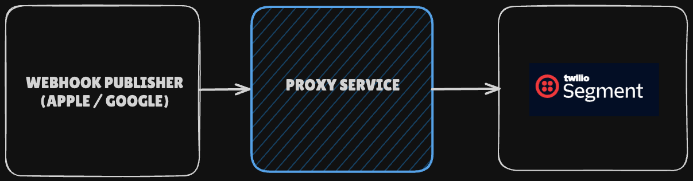

# Proxy-Service

A small Go service that normalizes Apple and Google subscription webhooks into canonical event types and forwards Identify/Track analytics to Twilio Segment. It handles both platforms uniformly.  

> **Why this exists:**  
> - **Learning exercise:** build something real in Go, step by step, and compare the developer experience with PHP/Node.  
> - **Discovery project:** explore Go’s strengths (static typing, concurrency, binary delivery, standard library).

---

## How this works

The service accepts a normalized webhook, resolves it to a canonical event, and forwards Identify/Track analytics to Twilio Segment. Both Apple and Google follow the same flow.


**At a glance**

1. `POST /webhook` receives a normalized subscription payload.
2. A delegator routes to the Apple or Google handler using a simple `supports(...)` check.
3. The handler decodes into `subnotes.Subscription`, validates brand, and resolves a canonical `SubscriptionEvent` using a lookup table.
4. Forwarders build and send Segment Identify + Track messages.

---

### Service Orientation




---

## Getting Started

### Prerequisites

- Go **1.23+**  
- Git

### Clone & Build

```bash
git clone https://github.com/garyclarke/proxy-service.git
cd proxy-service
go build -o proxy-service ./cmd/api
````

### Environment

By default the app reads `.env`. You can also pass flags:

```bash
export PORT=4000
export ENV=development
export DEBUG=true
export SEGMENT_SUBSCRIPTION_WRITE_KEY=YOUR_KEY
export SEGMENT_ENDPOINT=https://events.eu1.segmentapis.com

./proxy-service
```

Or with flags:

```bash
./proxy-service \
  -port=4000 \
  -env=development \
  -debug=true \
  -segment-key=YOUR_KEY \
  -segment-endpoint=https://events.eu1.segmentapis.com
```

---

## Testing

Run all tests:

```bash
go test ./...
```

Key test packages:

* **`cmd/api/helpers_test.go`** writeJSON & readJSON
* **`cmd/api/middleware_test.go`** panic-recovery middleware
* **`internal/webhook/handler/handler_test.go`** delegator & handlers
* **`internal/event/forwarder`** mapping raw DTO → Identify/Track payloads
* **`internal/segment/identify`** & **`/track`** payload builders

---

## Branch summaries (build log)

This project was built incrementally. To see the story of how it came together, browse the **`branch-summaries/`** folder. Each branch has a short, structured HTML summary that’s richer than a commit message.

What you’ll find in each summary:

* **Purpose & context** - why the branch exists and what problem it solves.
* **Key changes** - the important code edits with just enough detail to follow along.
* **Decisions & trade-offs** - reasoning, alternatives considered, and why a path was chosen.
* **Testing results** - what was validated and how.
* **Next steps** - what’s intentionally left for the following branch.

How to read it:

* Start at the lowest numbered branches and move forward (e.g. `66-google-subscription-structs` → `71-test-create-google-event` → `72-google-status-change-event`).
* Use the summaries as a narrative guide; commits are snapshots, **summaries are the storyboard**.

---

## Debugging & Instrumentation

* **Live-reload** with [air](https://github.com/cosmtrek/air)

* **Structured logging** via Go’s [`slog`](https://pkg.go.dev/log/slog)

* **Debug-dump** anywhere with:

```go
package main

import "github.com/garyclarke/proxy-service/debug"
// …
debug.DD(foo, bar)
// → prints to stdout + panics to halt the request
```

* **Header logging** in debug mode (`app.logHeaders`)

---

## ➕ Adding New Scenarios

1. **Define DTO** in `internal/webhook/dto/...`
2. **Mapping**: add mapper in `internal/event/forwarder`
3. **Segment builders**: update `internal/segment/identify` or `/track`
4. **Test** mapping + end-to-end in `cmd/api/handlers_test.go`
5. **Wire** into `main.go` by constructing your forwarder and passing into `NewHandlerDelegator(...)`

---

*Happy hacking!*

